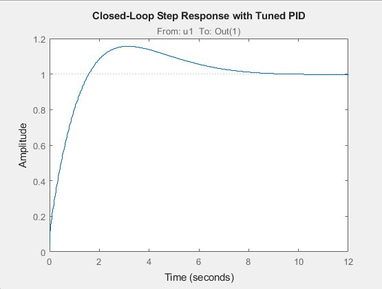

# Servo-SysID — Servo System Identification & PID Tuning

**Author:** Nour Ammar

---

## Overview

This project characterizes the real-world dynamic behavior of a hobby servo motor by collecting hardware step-response data using an Arduino and a potentiometer, fitting a transfer function model using MATLAB's System Identification Toolbox, and tuning a discrete PID controller using `pidtune`.

The motivation was to study whether a servo actually reaches its commanded angle accurately, understand the lag and overshoot in its real response, and design a feedback controller that could correct for those deviations. The PID gains were validated in closed-loop MATLAB simulation.

This is a practical controls study that can be applied to any hobby servo where positional accuracy matters.

---

## Workflow

```
Servo_Pot_Readings.ino  (Arduino)
  - Sweeps servo from 1000 µs to 2000 µs PWM (0° to 180°)
  - Reads potentiometer angle feedback via analogRead (A0)
  - Logs time (ms), PWM input (µs), angle output (°) to Serial at 50 Hz
        │
        ▼  CSV exported from Serial Monitor
        │
Servoos.csv
  - Columns: time_ms, pwm_input_us, angle_output_deg
        │
        ▼
Servo_SysID.m  (MATLAB)
  - Loads CSV, converts time to seconds
  - Prepends 300 zero samples to improve transient capture
  - Applies 5 Hz lowpass filter to angle output to remove noise
  - Creates iddata object and fits 2nd order transfer function (tfest)
  - Discretizes model using ZOH (Ts ≈ 0.021 s)
  - Tunes discrete PID controller using pidtune
  - Plots closed-loop step response
```

---

## What This Study Shows

A common assumption when using hobby servos is that `servo.write(90)` reliably moves the shaft to exactly 90°. In practice, servos have internal mechanical and electrical dynamics that introduce lag, overshoot, and steady-state error — especially under load.

This study measures those dynamics directly from hardware using a potentiometer as a real angle feedback sensor, identifies a mathematical model of the servo's behavior, and designs a PID controller that could close the position loop and correct for those errors in real time.

---

## Results

### Identified Transfer Function
- **Model fit accuracy:** 88.80%
- **Model order:** 2nd order, 1 zero
- **Fit method:** `tfest` via MATLAB System Identification Toolbox

The identified continuous-time transfer function:

```
        0.5556s + 0.2407
G(s) = ------------------
       s² + 46.03s + 3.08e-10
```

| Property | Value |
|----------|-------|
| Numerator | [0.5556, 0.2407] |
| Denominator | [1, 46.0310, 3.0785e-10] |
| Noise Variance | 0.1947 |
| Model Fit | 88.80% |

The near-zero constant term in the denominator (3.08e-10) indicates the servo behaves close to an integrating system at low frequencies — meaning without feedback it drifts rather than holding position, which is exactly the behavior that motivates closed-loop PID control.

### Discretized & Tuned PID Gains

The transfer function was discretized using Zero-Order Hold (ZOH) at Ts = 0.0210 s, then a discrete PID controller was tuned using `pidtune`:

| Parameter | Value |
|-----------|-------|
| Kp | 14.4956 |
| Ki | 98.1215 |
| Kd | 0.1414 |
| Tf | 0 |
| Integration formula | Forward Euler |
| Derivative formula | Forward Euler |
| Sampling time (Ts) | 0.0210 s |

The high Ki value (98.12) relative to Kp (14.50) reflects the integrating nature of the plant — significant integral action is needed to correct steady-state position error.

### Closed-Loop Step Response



| Metric | Observed |
|--------|----------|
| Overshoot | ~17% |
| Settling time | ~10 seconds |
| Steady-state error | ~0 (integral action eliminates it) |

The tuned controller produces a stable closed-loop response. The overshoot and settling time are acceptable for a proof-of-concept servo position controller.

---

## Hardware Setup

| Component | Detail |
|-----------|--------|
| Microcontroller | Arduino (servo pin: D9, pot pin: A0) |
| Servo | Standard hobby servo |
| Feedback sensor | Potentiometer mechanically coupled to servo shaft |
| Sampling rate | 50 Hz (20 ms delay) |
| PWM sweep range | 1000 µs → 2000 µs (0° → 180°) |
| PWM step size | 7 µs per sample |

**Potentiometer coupling:** A 3D-printed piece connected the servo horn to the potentiometer shaft, allowing the pot to rotate with the servo and provide real angle feedback as a voltage reading on A0, mapped to degrees using `analogRead`.

---

## Repository Structure

```
Servo-SysID/
├── Servo_Pot_Readings.ino     # Arduino: servo sweep + potentiometer data logger
├── Servo_SysID.m              # MATLAB: system ID, transfer function fit, PID tuning
├── Servoos.csv                # Logged data: time, PWM input, angle output
├── step_response.png          # Closed-loop step response plot from MATLAB
└── README.md
```

---

## How to Run

**Step 1 — Collect data (CSV already included)**
1. Upload `Servo_Pot_Readings.ino` to an Arduino
2. Mechanically couple a potentiometer to the servo shaft
3. Open Serial Monitor at 115200 baud
4. Copy output to a `.csv` file named `Servoos.csv`

**Step 2 — Run MATLAB system identification**
1. Open `Servo_SysID.m` in MATLAB
2. Make sure `Servoos.csv` is in the same directory
3. Run the script — it will display the transfer function, PID gains, and plot the step response

**Requirements:** MATLAB with System Identification Toolbox and Control System Toolbox
